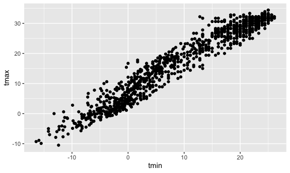
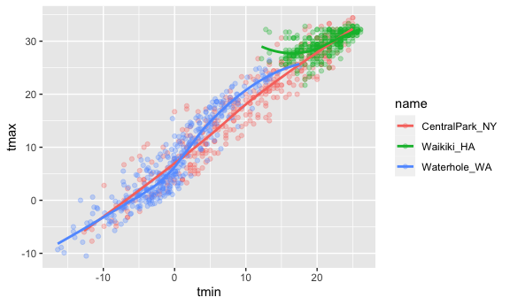
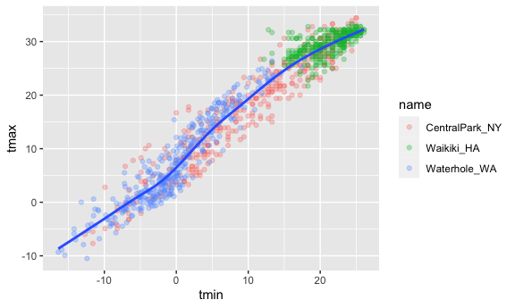
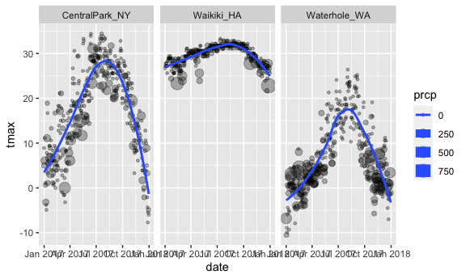
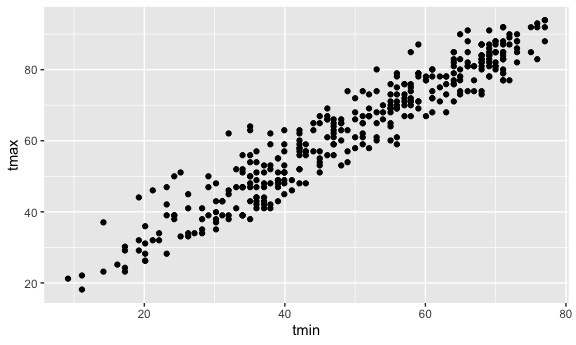
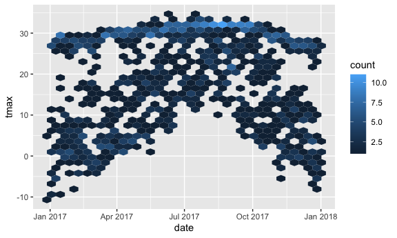
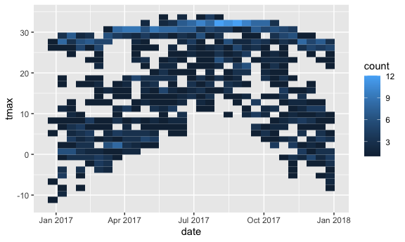

ggplot2\_part1
================
Yang Gao
10/5/2021

``` r
library(tidyverse)
```

    ## ── Attaching packages ─────────────────────────────────────── tidyverse 1.3.1 ──

    ## ✓ ggplot2 3.3.5     ✓ purrr   0.3.4
    ## ✓ tibble  3.1.4     ✓ dplyr   1.0.7
    ## ✓ tidyr   1.1.3     ✓ stringr 1.4.0
    ## ✓ readr   2.0.1     ✓ forcats 0.5.1

    ## ── Conflicts ────────────────────────────────────────── tidyverse_conflicts() ──
    ## x dplyr::filter() masks stats::filter()
    ## x dplyr::lag()    masks stats::lag()

``` r
library(ggridges)
```

load in a dataset that we often use.

``` r
weather_df = 
  rnoaa::meteo_pull_monitors(
    c("USW00094728", "USC00519397", "USS0023B17S"),
    var = c("PRCP", "TMIN", "TMAX"), 
    date_min = "2017-01-01",
    date_max = "2017-12-31") %>%
  mutate(
    name = recode(
      id, 
      USW00094728 = "CentralPark_NY", 
      USC00519397 = "Waikiki_HA",
      USS0023B17S = "Waterhole_WA"),
    tmin = tmin / 10,
    tmax = tmax / 10) %>%
  select(name, id, everything())
```

    ## Registered S3 method overwritten by 'hoardr':
    ##   method           from
    ##   print.cache_info httr

    ## using cached file: ~/Library/Caches/R/noaa_ghcnd/USW00094728.dly

    ## date created (size, mb): 2021-10-05 10:31:13 (7.602)

    ## file min/max dates: 1869-01-01 / 2021-10-31

    ## using cached file: ~/Library/Caches/R/noaa_ghcnd/USC00519397.dly

    ## date created (size, mb): 2021-10-05 10:31:22 (1.697)

    ## file min/max dates: 1965-01-01 / 2020-02-29

    ## using cached file: ~/Library/Caches/R/noaa_ghcnd/USS0023B17S.dly

    ## date created (size, mb): 2021-10-05 10:31:26 (0.912)

    ## file min/max dates: 1999-09-01 / 2021-09-30

## Scatterplot

tmax vs tmin

``` r
weather_df %>% 
  ggplot (aes (x= tmin, y= tmax)) + geom_point()
```

    ## Warning: Removed 15 rows containing missing values (geom_point).

<!-- -->

you can save ggplots

``` r
ggp_tmax_tmin = 
  weather_df %>% 
  ggplot (aes (x= tmin, y= tmax)) + geom_point()

ggp_tmax_tmin
```

    ## Warning: Removed 15 rows containing missing values (geom_point).

<!-- --> ggsave()

## fancy it up

color, … other stuff

``` r
weather_df %>% 
  ggplot (aes (x= tmin, y= tmax, color = name )) + geom_point(alpha=0.3) + geom_smooth( se=FALSE)
```

    ## `geom_smooth()` using method = 'loess' and formula 'y ~ x'

    ## Warning: Removed 15 rows containing non-finite values (stat_smooth).

    ## Warning: Removed 15 rows containing missing values (geom_point).

<!-- -->

``` r
weather_df %>% 
  ggplot (aes (x= tmin, y= tmax )) + geom_point(aes(color = name),alpha=0.3) + geom_smooth( se=FALSE)
```

    ## `geom_smooth()` using method = 'gam' and formula 'y ~ s(x, bs = "cs")'

    ## Warning: Removed 15 rows containing non-finite values (stat_smooth).

    ## Warning: Removed 15 rows containing missing values (geom_point).

<!-- -->

``` r
weather_df %>% 
  ggplot (aes (x= tmin, y= tmax, color = name )) + geom_point(alpha=0.3) + geom_smooth( se=FALSE)+
  facet_grid(.~ name)
```

    ## `geom_smooth()` using method = 'loess' and formula 'y ~ x'

    ## Warning: Removed 15 rows containing non-finite values (stat_smooth).

    ## Warning: Removed 15 rows containing missing values (geom_point).

<!-- -->

more plots

``` r
weather_df %>% 
  ggplot (aes(x= date, y= tmax, size = prcp)) + 
  geom_point(alpha =.3)+
  facet_grid(.~ name)+
  geom_smooth(se= FALSE) #se:standard error
```

    ## `geom_smooth()` using method = 'loess' and formula 'y ~ x'

    ## Warning: Removed 3 rows containing non-finite values (stat_smooth).

    ## Warning: Removed 3 rows containing missing values (geom_point).

<!-- -->

## Use data manipulation as part of this

``` r
weather_df %>% 
  filter (name =="CentralPark_NY") %>% 
  mutate(
    tmax = tmax * (9/5) + 32,
    tmin = tmin *(9/5) + 32
  ) %>% 
  ggplot(aes (x= tmin, y= tmax)) + geom_point()
```

<!-- -->

## Stacking geoms

Which geoms do you want?

``` r
weather_df %>% 
  ggplot(aes( x= date, y= tmax, color=name)) +
  geom_smooth() #only showing the smooth curve
```

    ## `geom_smooth()` using method = 'loess' and formula 'y ~ x'

    ## Warning: Removed 3 rows containing non-finite values (stat_smooth).

<!-- -->

``` r
weather_df %>% 
  ggplot( aes(x= date, y= tmax)) +geom_hex()
```

    ## Warning: Removed 3 rows containing non-finite values (stat_binhex).

<!-- -->

``` r
weather_df %>% 
  ggplot( aes(x= date, y= tmax)) +geom_bin_2d()
```

    ## Warning: Removed 3 rows containing non-finite values (stat_bin2d).

<!-- -->
